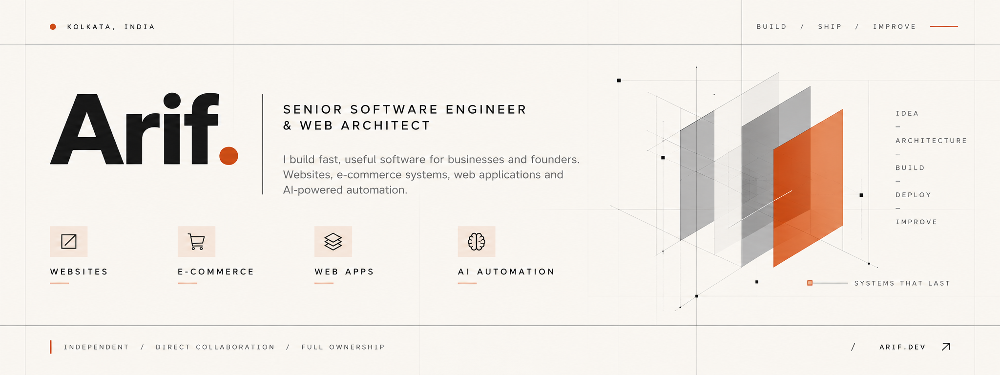
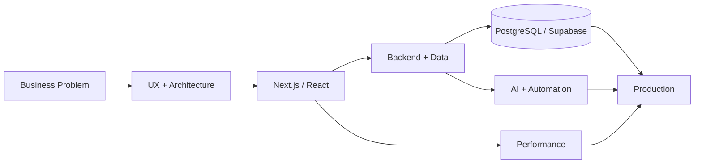
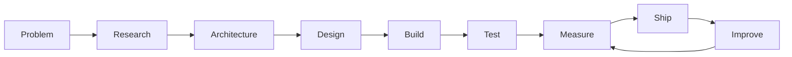

<p align="center">
  
</p>

<h3 align="center">
  Senior Software Engineer · Web Architect · AI Automation
</h3>

<p align="center">
  <a href="https://arif.work"><strong>Website</strong></a> ·
  <a href="mailto:arif@arif.work"><strong>Email</strong></a> ·
  <a href="https://github.com/lucifer-kj"><strong>GitHub</strong></a>
</p>

<table width="100%">
  <tr>
    <td width="20%"><strong>Focus</strong></td>
    <td>
      
      
      
    </td>
  </tr>
  <tr>
    <td><strong>Frontend</strong></td>
    <td>
      
      
      
      
    </td>
  </tr>
  <tr>
    <td><strong>Backend &amp; Data</strong></td>
    <td>
      
      
      
      
    </td>
  </tr>
  <tr>
    <td><strong>Automation &amp; AI</strong></td>
    <td>
      
      
      
      
    </td>
  </tr>
  <tr>
    <td><strong>Infrastructure</strong></td>
    <td>
      
      
      
    </td>
  </tr>
  <tr>
    <td><strong>Approach</strong></td>
    <td><code>Performance</code> · <code>Simplicity</code> · <code>Accessibility</code> · <code>Maintainability</code> · <code>Ownership</code></td>
  </tr>
</table>

## About

I am **Arif**, an independent Senior Software Engineer and Web Architect based in Kolkata, India, working with founders and businesses globally.

I operate as a solo individual practitioner—not an agency. When you collaborate with me, you work directly with the engineer responsible for the architecture, implementation, and delivery of your digital product.

I build digital systems around the actual business problem:
- **Fast mobile experiences** designed for real-world network conditions.
- **Direct conversion pathways** connecting high-intent visitors to WhatsApp or consultation.
- **Full client ownership** of source code, intellectual property, and deployment assets.
- **Predictable delivery** through focused scopes, clear milestones, and direct communication.

---

## How I Build



> *I don't start with a framework.*  
> *I start with the problem, reduce the system to what is actually necessary, then build, measure, and ship.*

---

## What I Build

<table>
  <tr>
    <td width="50%" valign="top">
      <h3>⚡ High-Performance Websites</h3>
      <p>Marketing sites, landing pages, and business websites designed around speed, accessibility, and clear conversion paths.</p>
    </td>
    <td width="50%" valign="top">
      <h3>🛒 E-commerce</h3>
      <p>D2C storefronts, catalogues, and commerce experiences built for product discovery and purchasing.</p>
    </td>
  </tr>
  <tr>
    <td valign="top">
      <h3>🧩 Custom Web Applications</h3>
      <p>Dashboards, internal tools, SaaS products, and client portals built around specific workflows.</p>
    </td>
    <td valign="top">
      <h3>🧠 AI & Automation</h3>
      <p>AI-powered workflows, agents, integrations, and operational automations that reduce repetitive work.</p>
    </td>
  </tr>
</table>

---

## Commercial Services

- **01 — High-Converting Landing Pages**  
  Focused experiences for paid traffic, product launches, and customer acquisition, with direct inquiry routing.
- **02 — Complete Business Websites**  
  Multi-page digital presence designed to establish credibility, communicate value, and generate qualified enquiries.
- **03 — Custom Web Applications & E-commerce**  
  Bespoke platforms, client portals, SaaS interfaces, and storefront experiences engineered around the actual business workflow.
- **04 — Ongoing Engineering & Performance Defense**  
  Maintenance, monitoring, updates, and continuous optimization to keep a digital product fast, secure, and resilient.

---

## Selected Work

<table>
  <tr>
    <td width="50%" valign="top">
      <h4>Naaz Book Depot</h4>
      <p><em>E-commerce · Islamic Books &amp; Publishing</em></p>
      <p>Online storefront and digital catalogue for an established publishing business.</p>
      <p><strong>Built around:</strong> product discovery · catalogue structure · commerce</p>
      <p><a href="https://naazbook.in">Visit naazbook.in →</a></p>
    </td>
    <td width="50%" valign="top">
      <h4>HairCrew</h4>
      <p><em>D2C · Professional Haircare</em></p>
      <p>Direct-to-consumer haircare storefront with multi-category product discovery and cart workflows.</p>
      <p><strong>Built around:</strong> product UX · commerce · responsive delivery</p>
      <p><a href="https://haircrew.in">Visit haircrew.in →</a></p>
    </td>
  </tr>
  <tr>
    <td valign="top">
      <h4>Athar Boutique</h4>
      <p><em>Fashion · Islamic Apparel</em></p>
      <p>Mobile-first apparel catalogue with a direct-consultation and social-commerce workflow.</p>
      <p><strong>Built around:</strong> mobile UX · catalogue · customer enquiry flow</p>
      <p><a href="https://athar-boutique.vercel.app">View project →</a></p>
    </td>
    <td valign="top">
      <h4>Script Forge</h4>
      <p><em>Software · Developer Tool</em></p>
      <p>Interactive software utility and web application interface.</p>
      <p><strong>Built around:</strong> application UX · TypeScript · product interaction</p>
      <p><a href="https://script-forge-alpha.vercel.app/">View project →</a></p>
    </td>
  </tr>
  <tr>
    <td valign="top">
      <h4>All Buzz Cleaning × CRUX</h4>
      <p><em>Local Business · Review Management</em></p>
      <p>A UK local-service business presence connected with automated review-management workflows.</p>
      <p><strong>Built around:</strong> local business UX · review workflows · automation</p>
      <p><a href="https://allbuzzcleaning.vercel.app">View project →</a></p>
    </td>
    <td valign="top">
      <h4>Prasu Techno</h4>
      <p><em>B2B · Technology</em></p>
      <p>Corporate web presence focused on communicating industrial technology services and enterprise enquiries.</p>
      <p><strong>Built around:</strong> B2B communication · responsive UX · lead generation</p>
      <p><a href="https://prasutechno.com">Visit prasutechno.com →</a></p>
    </td>
  </tr>
  <tr>
    <td valign="top">
      <h4>Mumma's Bee</h4>
      <p><em>D2C · E-commerce</em></p>
      <p>Consumer storefront focused on rapid mobile product discovery.</p>
      <p><strong>Built around:</strong> product presentation · mobile UX · commerce</p>
      <p><a href="https://mummasbee.vercel.app">View project →</a></p>
    </td>
    <td valign="top">
      <h4>More in Development</h4>
      <p><em>Software · Automation · AI</em></p>
      <p>Additional internal tools, automation systems, and experimental software projects are continuously being built and tested.</p>
    </td>
  </tr>
</table>

---

## Engineering Philosophy



### Principles

- **Simplicity over unnecessary complexity**  
  Use the smallest system that solves the real problem.
- **Performance is a feature**  
  Fast interfaces improve usability, accessibility, and conversion.
- **Client-side JavaScript should earn its place**  
  Prefer server-first rendering and isolate interactive behaviour where it is actually needed.
- **Build for ownership**  
  Projects should remain understandable and maintainable after handover.
- **Measure what matters**  
  Validate performance and technical behaviour rather than relying on assumptions.

---

## Technology

| Layer | Tools &amp; Ecosystem |
|---|---|
| **Frontend** | Next.js · React · TypeScript · Tailwind CSS · shadcn/ui |
| **Backend &amp; Data** | Node.js · PostgreSQL · Supabase · Prisma |
| **AI &amp; Automation** | n8n · AI Agents · LLM APIs · Workflow Automation |
| **Infrastructure** | Vercel · Cloud Infrastructure · CI/CD · Performance Monitoring |

---

## Development Workflow

```
01 Understand  ──>  02 Architect  ──>  03 Design  ──>  04 Build  ──>  05 Test  ──>  06 Measure  ──>  07 Ship  ──>  08 Improve
```

*This keeps the engineering process focused on outcomes instead of technology for its own sake.*

---

## Collaboration

Every engagement is structured around:
- **Direct communication**: Work directly with the engineer doing the build.
- **Transparent milestones**: Clear scope, milestones, and delivery expectations.
- **Complete ownership**: Source code and project assets remain yours.
- **Focused engineering**: No unnecessary layers or agency handoffs.
- **Performance mindset**: Speed and usability are considered throughout the build.

---

## Connect

<p align="center">
  <a href="https://arif.work">
    
  </a>
  &nbsp;
  <a href="mailto:arif@arif.work">
    
  </a>
  &nbsp;
  <a href="https://github.com/lucifer-kj">
    
  </a>
</p>

<p align="center">
  <strong>Build something useful.</strong>
</p>

<p align="center">
  <sub>© 2026 Arif. All rights reserved.</sub>
</p>
