# 01. User Flows & Behavioral Architecture

**Project**: Arif Portfolio  
**Brand Identity**: Arif — Freelance Senior Software Engineer & Web Architect (Solo Practitioner)  
**Primary Conversion Target**: Convert Indian business owners, D2C founders, and tech operators into direct WhatsApp inquiries or 3-minute async video teardown requests.

---

## 1. Executive Summary & Visitor Psychology

Visitors to Arif’s website are Indian business owners, founders, and operators. They are not looking for academic computer science papers. They are dealing with real business problems:
- **Their website takes 5–8 seconds to load on mobile**, burning through their Meta (Instagram/Facebook) and Google Ads budget.
- **They get traffic, but zero calls or WhatsApp messages.**
- **They were burned by an agency** that charged ₹1.5L–₹3L, dragged the project for 4 months, and handed them a fragile WordPress site that breaks on every update.
- **They are exhausted by middlemen** (sales reps, project managers, junior interns) and want to talk directly to the senior engineer who will actually write the code.

Every user journey is designed to move visitors through a simple, trust-building psychological sequence:

```
[Recognize Pain: "My site is slow / broken"] 
   ──> [See Proof: "Arif loads in 0.6s on mobile"] 
   ──> [Understand Price & Timeline: "Clear ₹-pricing"] 
   ──> [Frictionless Contact: "1-Tap WhatsApp / 3-Min Video"]
```

---

## 2. Target Personas in the Indian Market

### Persona A: "The Bleeding Ad-Spender" (Ankit, 31 — D2C / E-Commerce Founder)
* **Profile**: Operates a fast-growing apparel, wellness, or consumer brand. Spends ₹1L–₹5L/month on Meta & Google Ads.
* **Pain Point**: High ad click-through rate, but 65%+ of mobile clicks bounce before the landing page finishes loading on Jio 4G / Airtel mobile data. Mobile Lighthouse score is 24.
* **Mindset**: Impatient, numbers-driven. Calculates cost-per-click daily.
* **Key Objection**: *"Will a custom landing page really improve my sales, or is this just fancy design?"*
* **Trigger to Reach Out**: Seeing Arif's sub-second mobile benchmarks and discovering a **High-Converting Landing Page (₹18k–₹32k)** built in 4 days with 1-tap WhatsApp and checkout integrations.

### Persona B: "The Established SME / Premium Service Owner" (Vikram, 44 — Founder / Director)
* **Profile**: Runs a high-ticket B2B manufacturing, corporate consulting, or medical facility.
* **Pain Point**: Website looks like it was designed in 2017. When corporate clients search them on Google, the site looks unpolished and outdated.
* **Mindset**: Values reputation, reliability, and business pedigree. Does not understand complex code terms, but knows when a website looks elite.
* **Key Objection**: *"I don't have time to manage a developer. Will this drag on for months?"*
* **Trigger to Reach Out**: Seeing the clean **Complete Business Website (₹45k–₹75k)** package delivered in 10–12 days with Swiss editorial elegance (Kolk design benchmark), zero maintenance headaches, and direct access to Arif.

### Persona C: "The Burned Founder" (Meera, 36 — Agency Victim)
* **Profile**: Founder of a boutique consumer brand or regional business.
* **Pain Point**: Paid a digital marketing agency ₹1.8L for a website 6 months ago. The site arrived late, was riddled with broken mobile layouts, and every minor text edit takes 2 weeks and an extra invoice.
* **Mindset**: Deeply skeptical of agencies. Frustrated by account managers who don't understand code.
* **Key Objection**: *"Are you an agency with junior developers, or will you personally build this?"*
* **Trigger to Reach Out**: Arif's upfront pledge: **"I am a solo freelance engineer. You talk directly to me. 100% code ownership in your name. Zero middlemen."**

### Persona D: "The Early-Stage Tech Founder" (Rohan, 29 — SaaS / Tech Co-Founder)
* **Profile**: Technical or product founder of a funded startup or fast-moving software tool.
* **Pain Point**: Internal dev team is 100% tied up building the core product. The public marketing site looks generic, lacks punch, and fails Core Web Vitals.
* **Mindset**: Developer-literate. Appreciates clean Next.js 15, TypeScript strictness, and 60 FPS craft.
* **Key Objection**: *"Can an individual build a world-class site faster than our internal team?"*
* **Trigger to Reach Out**: The sheer technical precision of Arif's own website (100/100 Lighthouse, instant TTFB, Lenis smooth scrolling) and a **Custom Next.js Web App / Launch Site (₹90k–₹1.6L)**.

---

## 3. The 4 Master User Journeys

```mermaid
flowchart TD
    subgraph Flow1["Flow 1: The Fast WhatsApp Track (Mobile Visitor)"]
        H1["Land on Arif. Website via Mobile"] --> H2["Notice Instant Load Speed (< 0.8s on 4G)"]
        H2 --> H3["Scroll Swiss Editorial Hero & Work Highlights"]
        H3 --> H4["Tap Fixed Bottom Action: 'WhatsApp Arif'"]
        H4 --> H5["WhatsApp Opens with Prefilled Query\n(< 45 Seconds Total)"]
    end

    subgraph Flow2["Flow 2: The Free 3-Min Video Teardown Track"]
        V1["Visitor Notes Frustration with Current Site"] --> V2["Clicks 'Get Free 3-Min Video Review'"]
        V2 --> V3["Brief Drawer Slides Open (URL + Pain Point)"]
        V3 --> V4["Submits 2 Fields (Website URL + WhatsApp/Email)"]
        V4 --> V5["Arif Sends Loom Video Teardown within 24h\n(Shows Bottlenecks & Fix Plan)"]
    end

    subgraph Flow3["Flow 3: The Work & Speed Verification Track"]
        W1["Click '#work' in Nav"] --> W2["Inspect Tactile Project Cards & Live Metrics"]
        W2 --> W3["Interact with Live Speed Benchmark Widget\n(Audits Arif's own site in real-time)"]
        W3 --> W4["Reviews 'Why Hire a Solo Architect vs Agency'"]
        W4 --> W5["Selects Appropriate Service Tier"]
    end

    subgraph Flow4["Flow 4: The Scope & Transparent Pricing Track"]
        S1["Click '#services' in Nav"] --> S2["Review 3 Fixed Freelance Tiers:\n• Landing Page (₹18k–₹32k)\n• Business Website (₹45k–₹75k)\n• Custom Web App (₹90k–₹1.6L)"]
        S2 --> S3["Verify Included Deliverables & Timeline"]
        S3 --> S4["Click 'Inquire on WhatsApp' or 'Schedule Call'"]
    end
```



---

## 4. Multi-Channel Conversion Architecture

Every section provides frictionless conversion options tailored to how Indian business owners communicate:

| Channel | Priority in India | Friction Level | Target Visitor | Implementation |
|---|---|---|---|---|
| **WhatsApp Direct** | **Primary (#1)** | **Zero (1 tap)** | Mobile founders, SME owners, fast decision makers. | Fixed bottom bar on mobile + floating CTA. `wa.me/91...` with prefilled contextual message. |
| **Free 3-Min Video Teardown** | **High (#2)** | Low (2 fields) | Skeptical owners who want proof before talking. | Slide-out drawer: Website URL + WhatsApp number. |
| **Cal.com Video Call** | Secondary (#3) | Medium (pick slot) | Tech founders and corporate clients who prefer a scheduled 20-min screen-share. | Embedded Cal.com modal. |
| **Direct Email** | Secondary (#4) | Low | Corporate procurement, formal briefs. | `arif@arif.build` with mailto trigger. |

### Contextual Prefilled WhatsApp Messages

* **From Hero**: `"Hi Arif, I saw your portfolio. I'm looking for a fast, modern website for my business: [Enter URL / Business Name]"`
* **From Landing Page Tier**: `"Hi Arif, I need a high-converting landing page for our ad campaigns (₹18k–₹32k range). Here is my current link: [Enter URL]"`
* **From Business Website Tier**: `"Hi Arif, I want to upgrade our business website with your Swiss design framework (₹45k–₹75k range). Let's connect: [Enter URL]"`
* **From Custom Web App Tier**: `"Hi Arif, I have a custom web application / e-commerce requirement. Can we discuss scope?"`
* **From Agency Burn Section**: `"Hi Arif, our current website is slow and broken. I want to work with a solo senior engineer. Here is our link: [Enter URL]"`

---

## 5. Drop-Off Mitigation Strategies

```
┌─────────────────────────────────────────────────────────────────────────────┐
│                       DROP-OFF MITIGATION MATRIX                            │
├──────────────────────────────┬──────────────────────────────────────────────┤
│ Potential Drop-Off Point     │ Architectural Countermeasure                 │
├──────────────────────────────┼──────────────────────────────────────────────┤
│ 1. Bounce in first 3 seconds │ Instant Sub-Second Load: Static Next.js 15   │
│                              │ SSG ensures instant display on mobile data.  │
├──────────────────────────────┼──────────────────────────────────────────────┤
│ 2. "Too technical / jargon"  │ Business-First Copy: Headlines talk about    │
│                              │ WhatsApp inquiries, mobile speed, and sales. │
├──────────────────────────────┼──────────────────────────────────────────────┤
│ 3. Fear of agency costs      │ Transparent Freelance Pricing: Upfront tiers │
│                              │ (₹18k, ₹45k, ₹90k) eliminate cost anxiety.   │
├──────────────────────────────┼──────────────────────────────────────────────┤
│ 4. Reluctance to fill forms  │ Persistent WhatsApp Button: Instant 1-tap    │
│                              │ chat without filling multi-step form fields. │
├──────────────────────────────┼──────────────────────────────────────────────┤
│ 5. Mobile thumb friction     │ Fixed Mobile Action Bar: Quick Inquire +     │
│                              │ WhatsApp sticky buttons at thumb level.      │
└──────────────────────────────┴──────────────────────────────────────────────┘
```

---

## 6. Key Performance Events to Track

| Event Name | Trigger Condition | Conversion Significance |
|---|---|---|
| `whatsapp_hero_click` | Taps hero WhatsApp CTA | Immediate Direct Lead |
| `whatsapp_mobile_bar_click` | Taps mobile bottom bar WhatsApp | Primary Mobile Lead |
| `video_teardown_submitted` | Submits URL for 3-min video review | Qualified Inbound Lead |
| `service_tier_inquire` | Clicks 'Inquire' on specific pricing tier | High Intent Lead with Scope |
| `cal_booking_confirmed` | Completes Cal.com appointment | High Intent Consultation |
| `case_study_viewed` | Expands or scrolls case study details | Social Proof Engagement |
