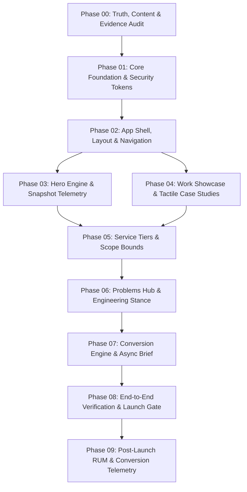

# Enterprise Engineering Specifications (`docs/spec/`)

**Project**: Portfolio for **Arif** (Freelance Senior Software Engineer & Web Architect)  
**Target Market**: Indian Businesses, D2C Brands, SMEs, and Tech Founders  
**Design Benchmark**: Replicated Pixel-by-Pixel from `C:\Users\USER\Documents\Builds\kolk` (Swiss-Modernist Linen Ivory `#FAF8F5`, Deep Espresso `#1C1917`, Signal Terracotta `#C05621`)  
**Architecture Standard**: Zero-Database Static Next.js 15 App Router, Strict TypeScript, Enterprise Security Headers, Structured JSON Observability, and Sub-Second Mobile Performance on Jio 4G.

---

## 1. Specification Dependency Graph & Execution Sequence

Development is partitioned into 10 structured phases (Phase 00 through Phase 09). To ensure zero architectural debt and flawless reproducibility, implementation follows this DAG / linear execution order:

---

## 2. Phase Specifications Index

| Specification File | Phase Title | Focus Area & Architectural Deliverables |
|---|---|---|
| **[`phase-00-truth-content-evidence-audit.md`](./phase-00-truth-content-evidence-audit.md)** | **Phase 00: Truth & Evidence Audit** | Truth framework, commercial claims audit, case-study taxonomy, content readiness lifecycle (`READY`, `NEEDS_VERIFICATION`, `PLACEHOLDER`, `DO_NOT_PUBLISH`). |
| **[`phase-01-core-foundation-security-design-tokens.md`](./phase-01-core-foundation-security-design-tokens.md)** | **Phase 01: Foundation & Security** | Strict CSP & security headers, Kolk OKLCH design tokens, structured JSON logger (`lib/logger.ts`), error boundaries, zero PII logging. |
| **[`phase-02-application-shell-navigation-mobile-dock.md`](./phase-02-application-shell-navigation-mobile-dock.md)** | **Phase 02: Shell & Navigation** | Sticky header, mobile action dock, semantic JSON-LD (`Person`/`ProfessionalService`), skip link, WCAG 2.2 AA accessibility. |
| **[`phase-03-hero-telemetry-trade-reticle.md`](./phase-03-hero-telemetry-trade-reticle.md)** | **Phase 03: Hero & Telemetry** | Plain-English value proposition, evidence-backed snapshot telemetry (`MEASURED`/`TARGET`/`REFERENCE`), animated geometric signal reticle. |
| **[`phase-04-work-showcase-tactile-case-studies.md`](./phase-04-work-showcase-tactile-case-studies.md)** | **Phase 04: Work Showcase** | Case study evidence provenance schema, tactile cards, cursor-following floating pills, paper-elevation shadows, verified/placeholder indicators. |
| **[`phase-05-service-tiers-freelance-pricing-retainer.md`](./phase-05-service-tiers-freelance-pricing-retainer.md)** | **Phase 05: Service Tiers** | Transparent pricing tiers (₹18k–₹32k, ₹45k–₹75k, ₹90k–₹1.6L, ₹15k/mo retainer), price vs estimate distinction, client obligations, scope limits. |
| **[`phase-06-problems-agency-comparison-about-stance.md`](./phase-06-problems-agency-comparison-about-stance.md)** | **Phase 06: Problems & Stance** | Constructive agency vs solo engineer contrast, senior craft standards, direct engineer access, about narrative. |
| **[`phase-07-conversion-engine-async-brief-drawer-contact.md`](./phase-07-conversion-engine-async-brief-drawer-contact.md)** | **Phase 07: Conversion Engine** | Inverted Obsidian contact section, 2-field slide-out brief drawer, rate-limiting & honeypot defense, Cal.com embed, WhatsApp prefill fallback. |
| **[`phase-08-verification-security-audit-launch-gate.md`](./phase-08-verification-security-audit-launch-gate.md)** | **Phase 08: Verification & Launch** | Hard blockers vs tiered performance targets (Good, Target, Stretch), repeatable test harness, category asset budgets. |
| **[`phase-09-real-user-monitoring-conversion-intelligence.md`](./phase-09-real-user-monitoring-conversion-intelligence.md)** | **Phase 09: Post-Launch RUM** | Core Web Vitals RUM collector (`app/reportWebVitals.ts`), conversion milestone events (`lib/analytics.ts`), zero PII telemetry, optimization loop. |

---

## 3. Standard Quality Gate Architecture

Every specification in this directory implements a uniform **Quality Gate** with the following sections:
1. **Inputs & Prerequisites**: Artifacts, tokens, and schemas that must be established before phase work begins.
2. **Outputs & Deliverables**: Exact files, components, and configurations produced.
3. **Architectural & Design Constraints**: Performance budgets, accessibility criteria, and styling parameters.
4. **Acceptance Criteria**: Discrete, verifiable test cases.
5. **Verification Commands**: Exact CLI commands (`pnpm.cmd run typecheck`, etc.) required to prove correctness.
6. **Regression Prevention**: Specific checks ensuring prior phases remain undamaged.
7. **Definition of Done**: Final checklist before advancing to the next phase.

---

## 4. Execution Guidance for Antigravity AI Agents

When implementing any phase from this directory:
- **Always adhere to [`GEMINI.md`](../../GEMINI.md)**.
- **Never fabricate metrics or testimonials**: All user-facing numbers must match Phase 00 evidence statuses.
- **Always use `pnpm.cmd`** on Windows PowerShell for builds, scripts, and tests.
- **Zero TypeScript compromises**: Run `pnpm.cmd run typecheck` after every component change.
- **Preserve Kolk aesthetic fidelity**: Hairline grid (`hairline-grid`), paper shadows (`shadow-paper`), micro-labels (`.label-xs`), and Linen/Espresso/Terracotta palette.
