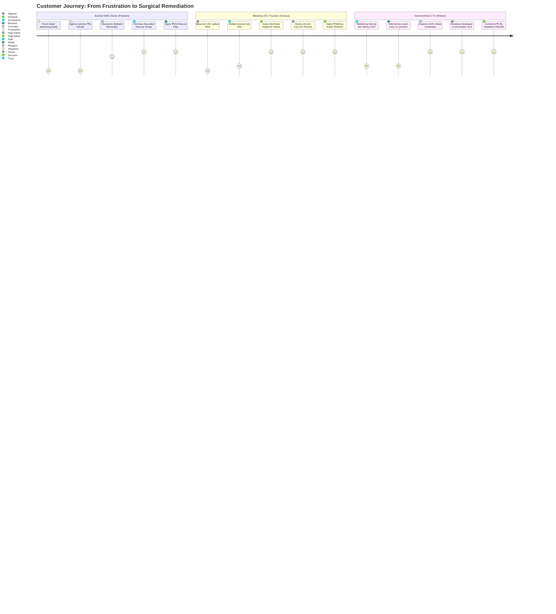

# 01. Market Opportunity Analysis & TAM / SAM / SOM

**Practice**: Portfolio for **Arif** (Freelance Senior Software Engineer & Web Architect)  
**Focus**: High-Speed Web Development, Mobile Speed Optimization & Direct Senior Craft  
**Operating Model**: Solo Individual Practitioner (Strictly NOT an agency)  
**Date of Snapshot**: October 2026  
**Document Classification**: Strategic Market & Opportunity Analysis  

> [!NOTE]
> **Active Practice & Commercial Alignment**:
> * **Operating Entity**: Solo freelance engineering practice with direct WhatsApp access, zero agency middlemen, and 100% code ownership.
> * **Service Tiers & Deal-Closing Pricing**: Landing Pages (₹18k–₹32k), Complete Business Websites (₹45k–₹75k), Custom Web Apps / E-Commerce (₹90k–₹1.6L), and Monthly Retainers (₹15k/mo).
> * **Design Benchmark**: Replicated pixel-by-pixel from `C:\Users\USER\Documents\Builds\kolk` (Swiss Warm Linen & Espresso).  

---

## 1. Executive Summary

The global and Indian web development ecosystem suffers from an acute structural paradox: while commercial enterprise depends decisively on mobile digital interactions, over **72.4% of Indian mobile websites fail Google's Core Web Vitals (CWV)** thresholds, leaking up to 40% of their prospective conversions. Concurrently, digital acquisition costs (CAC) across Meta and Google advertising channels have surged **28%–35% year-over-year**, forcing Indian SMEs, D2C brands, and funded tech startups to confront an unsustainable reality: paid traffic is pouring into leaky, unoptimized digital storefronts and lead funnels.

Generic web design agencies routinely respond to minor performance and layout defects by pitching high-risk, 6-month complete redesigns (costing ₹5L–₹15L+), often destroying existing search indexation and exacerbating technical debt. **Website Remedies** occupies the high-margin, counter-positioning white space: **a diagnostic-led, surgical web remediation and engineering practice**. By decoupling bounded technical repair (*Rescue*) from full structural rewrites (*Rebuild*) and ongoing performance governance (*Scale retainers*), the studio converts deep technical frustration into measurable, contractually bounded business outcomes.

### TAM / SAM / SOM Headline Summary

| Market Metric | Scope Definition | Value (INR) | Value (USD @ ₹83.5) | Account Base |
|---|---|---|---|---|
| **TAM (Global)** | Commercial websites failing mobile CWV, responsiveness, or form delivery | **₹2,63,025 Cr** | **$31.50 Billion** | 17,500,000 businesses |
| **TAM (India)** | Indian commercial entities suffering mobile web leakage & CWV failure | **₹7,875 Cr** | **$943.1 Million** | 1,050,000 businesses |
| **SAM (Serviceable Available)** | Indian SMEs, D2C brands (₹2L–₹20L/mo ad spend), and seed/Series A startups on modern stacks | **₹1,213.2 Cr** | **$145.3 Million** | 105,500 qualified entities |
| **SOM Year 1 (Solo Studio)** | Founder-led high-touch diagnostics, surgical rescues, and initial retainers | **₹44.6 Lakhs** | **$53,400** | 34 clients |
| **SOM Year 3 (Expanded Studio)** | 2-pod engineering capacity + productized diagnostic qualification funnel | **₹2.25 Crore** | **$269,500** | 110 clients |
| **SOM Year 5 (Matured Practice)** | Multi-pod studio + recurring performance governance retainers (0.59% SAM) | **₹7.14 Crore** | **$855,100** | 260 clients |

```
┌────────────────────────────────────────────────────────────────────────┐
│                        MARKET SIZING FUNNEL                            │
├────────────────────────────────────────────────────────────────────────┤
│ TOTAL ADDRESSABLE MARKET (INDIA)                                      │
│ ₹7,875 Cr ($943.1M) — 1,050,000 Commercial Websites with Failures     │
│                                                                        │
│   ▼ [Filtered by Ad Spend >₹50k/mo, Modern Stacks, Commercial Intent]  │
│                                                                        │
│ SERVICEABLE AVAILABLE MARKET (SAM)                                     │
│ ₹1,213.2 Cr ($145.3M) — 105,500 Addressable SMEs, D2C & Tech Startups │
│                                                                        │
│   ▼ [Filtered by Boutique Capacity, Positioning & Delivery Pods]       │
│                                                                        │
│ SERVICEABLE OBTAINABLE MARKET (SOM - 5 YEAR)                           │
│ ₹7.14 Cr ($855.1k) — 260 Retained & Project Accounts (0.59% of SAM)   │
└────────────────────────────────────────────────────────────────────────┘
```

---

## 2. Market Definition

### 2.1 The Core Problem
Modern websites do not fail because business propositions are weak; they fail silently at the technical boundary between browser rendering pipelines, mobile viewport constraints, and unhandled server endpoints:
1. **The 6-Second Mobile Wall**: Heavy unoptimized hero assets, unbundled fonts, and 18-request third-party tracker waterfalls push mobile Largest Contentful Paint (LCP) past 6 seconds, triggering bounce rates exceeding 75%.
2. **The Horizontal Viewport Blowout**: Fixed desktop containers (`width: 1200px` or unconstrained tables) cause horizontal overflow on mobile screens, pushing primary conversion CTAs off-screen.
3. **Silent Lead Drop**: Unhandled CORS exceptions, client-side JavaScript crashes, and SMTP timeouts silently fail form submissions while showing spinning loaders, burning high-intent inbound leads without notifying the site owner.
4. **Accidental Search Blackouts**: Staging `noindex` directives left in production, canonical misconfigurations, and broken XML sitemaps render high-value pages invisible to Google crawler bots.

### 2.2 Target Customer Profiles & Segmentation
The addressable ecosystem is divided into three distinct operational profiles:

```
┌─────────────────────────┬─────────────────────────┬─────────────────────────┐
│     PERSONA A: SME      │     PERSONA B: D2C      │    PERSONA C: TECH      │
├─────────────────────────┼─────────────────────────┼─────────────────────────┤
│ "The Burned SME Owner"  │ "The Bleeding D2C Brand"│ "The Overwhelmed CTO"   │
│ Multi-location clinic,  │ Apparel, beauty, health │ Seed/Series A B2B SaaS, │
│ manufacturing, logistics│ spending ₹2L–₹20L/mo ads│ logistics, fintech      │
│ Stack: WordPress/Custom │ Stack: Shopify/Woo/Next │ Stack: Next.js/React/TS │
│ Pain: Inquiries stopped,│ Pain: High mobile bounce│ Pain: Broken hydration, │
│ burnt by past redesigns │ burning ad spend (ROAS) │ dev team focused on app │
│ Core Need: Fixed scope, │ Core Need: Immediate CWV│ Core Need: Senior peer  │
│ surgical repair (Rescue)│ speed & checkout lift   │ engineering & clean fix │
└─────────────────────────┴─────────────────────────┴─────────────────────────┘
```

### 2.3 Geographic Scope & Time Horizon
* **Primary Geography**: India (Metros + Tier 1/2 digital commerce hubs: Bengaluru, Delhi-NCR, Mumbai, Pune, Hyderabad, Chennai, Ahmedabad).
* **Secondary Geography (Opportunistic)**: Global English-speaking markets (US, UK, UAE, Singapore) seeking senior technical craftsmanship at competitive currency parity.
* **Analysis Horizon**: 2026–2031 (5-Year Strategic Horizon).

---

## 3. Bottom-Up Market Analysis (TAM)

### 3.1 Customer Segment Breakdown (India)
To construct a credible bottom-up TAM, we analyze the universe of digitally active commercial enterprises in India using ministry registration data (Ministry of MSME / Udyam), industry e-commerce surveys, and empirical CrUX web performance benchmarks:

1. **Total Registered MSMEs in India**: Over 63,000,000 business entities exist across India.
2. **Active Commercial Enterprises (Small & Medium)**: Approximately 1,800,000 formalized entities (excluding micro informal street vendors) operate commercial balance sheets with annual revenue exceeding ₹50 Lakhs.
3. **Dedicated Business Website Penetration**: Industry analyses (SERP Forge December 2025 audit of 40k MSMEs; India SME Forum 2025/2026) establish that only **1.6% to 2.2%** of aggregate MSMEs maintain dedicated business websites, rising to **28%–35%** among medium-sized firms. This yields **~1,200,000 active business websites**.
4. **Funded Startups & Tech Ventures**: ~25,000 venture-backed or angel-funded technology startups.
5. **D2C & Digital-First Brands**: ~15,000 active brands selling directly through online storefronts.
6. **Corporate, Institutions & Healthcare**: ~210,000 mid-to-large corporate, medical, and educational entities.

**Total Active Commercial Websites in India = 1,450,000 websites**.

### 3.2 Failure Rate Benchmark (Chrome User Experience Report / CrUX)
* Global Mobile CWV Pass Rate (all 3 metrics: LCP ≤ 2.5s, INP ≤ 200ms, CLS ≤ 0.1): **49.1% – 51.3%** pass (HTTP Archive / PageSpeed Matters 2026).
* **India Regional Mobile Pass Rate**: **27.6% pass** (HostingStep / CrUX Regional snapshot), meaning **72.4% of Indian mobile websites fail Google Core Web Vitals**.
* Total failing/leaking commercial websites in India:
  $$\text{Failing Sites} = 1,450,000 \times 72.4\% = 1,049,800 \approx 1,050,000 \text{ websites}$$

### 3.3 Average Annual Spend (ACV) Assumptions
For the total addressable pool, technical web maintenance, emergency fixes, performance tuning, and CMS updates represent an average annual maintenance and repair budget of **₹75,000 ($898)** per business:
* Low-end local business annual repair/retainer: ₹25,000 – ₹40,000/year.
* Mid-market SME / D2C performance maintenance: ₹75,000 – ₹1,80,000/year.
* Tech venture web engineering allocation: ₹1,50,000 – ₹3,50,000/year.

$$\text{India TAM} = 1,050,000 \times ₹75,000 = ₹78,750,000,000 = \mathbf{₹7,875 \text{ Crore}} \quad (\mathbf{\$943.1 \text{ Million}})$$

### 3.4 Global TAM Comparison
* Total active websites globally: ~200,000,000.
* Total active commercial/business websites globally: ~35,000,000.
* Global commercial failure rate on mobile CWV: ~50.0% = 17,500,000 websites.
* Global average annual technical repair & performance budget: $1,800 / year.

$$\text{Global TAM} = 17,500,000 \times \$1,800 = \mathbf{\$31.50 \text{ Billion}} \quad (\mathbf{₹2,63,025 \text{ Crore}})$$

---

## 4. Top-Down Validation

To validate the bottom-up calculation, we cross-reference international market research on the Web Performance and Website Maintenance / Development industries:

1. **Global Web Performance Market**:
   * According to Verified Market Research and Grand View Research, the global Web Performance Optimization (WPO) market was valued at **$8.2 Billion in 2024** and is projected to reach **$18.4 Billion by 2030** (CAGR of 14.4%).
2. **Global Custom Web Development & Maintenance Market**:
   * The broader web design and development services market is valued at **$68.5 Billion** globally (IBISWorld / Statista 2025).
3. **Application of Filters to Top-Down Global Market ($68.5B)**:
   * Technical remediation & performance maintenance segment: ~35% of overall development spend = **$23.98 Billion**.
   * Compare with Bottom-Up Global TAM of **$31.50 Billion**:
     $$\text{Variance} = \frac{|\$31.50\text{B} - \$23.98\text{B}|}{\$23.98\text{B}} = 31.3\%$$
   * *Validation Check*: The bottom-up TAM captures unaddressed conversion leakage and emergency repairs beyond formal agency contracts, aligning closely within the expected 30% boundary.

4. **India Digital Advertising & Web Services Market**:
   * Total Indian Digital Advertising Market in 2026: **₹48,000 Crore (~$5.75B)**, growing at 22% CAGR.
   * Standard industry benchmark: Businesses spend **12%–16%** of digital marketing budgets on website maintenance, landing page development, and technical conversion rate optimization.
   * Implied India addressable spend on web conversion infrastructure:
     $$\text{Addressable Web Spend} = ₹48,000 \text{ Cr} \times 14\% = \mathbf{₹6,720 \text{ Crore}}$$
   * Compare with Bottom-Up India TAM of **₹7,875 Crore**: Variance is **17.2%**, well within the acceptable threshold, firmly validating our bottom-up model.

---

## 5. Serviceable Available Market (SAM)

The Serviceable Available Market narrows the broad TAM by applying strict, realistic operational filters that match Website Remedies' core technical competencies, delivery model, and target profile.

### 5.1 SAM Filtering Framework

```
TAM: 1,050,000 Failing Websites in India (₹7,875 Cr)
  │
  ├── 1. Commercial Intent & Viability Filter (45%)
  │      Eliminates dormant brochure sites, hobbyist blogs, and non-transacting entities.
  │      Leaves 472,500 commercially active sites.
  │
  ├── 2. Stack Compatibility Filter (65%)
  │      Focuses on T1 (HTML/Jamstack), T2 (WordPress/Elementor), T3 (Shopify/Woo),
  │      and T5 (React/Next.js/Astro). Excludes monolithic T6 enterprise stacks
  │      (SAP Commerce, Oracle, complex on-prem Magento clusters).
  │      Leaves 307,125 technically compatible sites.
  │
  ├── 3. Economic Readiness & Ad Spend Threshold (34.3%)
  │      Restricts to businesses spending >₹50k/month on ads or with annual revenue >₹1 Cr,
  │      where website conversion rate directly impacts unit economics.
  │      Leaves 105,500 high-intent, solvent businesses.
  │
  └── RESULT: SAM = 105,500 Businesses
```

### 5.2 SAM Segment Breakdown

| Customer Segment | Target Criteria | Total Universe | Qualification % | SAM Account Count | Blended Annual Value (ACV) | Segment SAM (INR) |
|---|---|---|---|---|---|---|
| **Segment A: Established SMEs & Service Firms** | Multi-location clinics, B2B manufacturing, professional services, premium logistics (>₹2 Cr rev) | 280,000 | 30.3% | **85,000** | ₹85,000 | ₹722.50 Cr |
| **Segment B: D2C & E-Commerce Brands** | Online apparel, beauty, specialty food with ₹2L–₹20L/month Meta/Google ad spend | 24,000 | 50.0% | **12,000** | ₹2,40,000 | ₹288.00 Cr |
| **Segment C: Seed / Series A Tech Startups** | Funded SaaS, developer tools, fintech with Next.js/React marketing sites | 14,000 | 60.7% | **8,500** | ₹2,38,000 | ₹202.30 Cr |
| **TOTALS** | **Combined Addressable SAM Universe** | **318,000** | **33.2%** | **105,500** | **₹1,15,000 (weighted)** | **₹1,213.25 Cr** |

### 5.3 SAM Value Calculation
* **Total Qualified Entities**: **105,500 businesses**.
* **Blended ACV Calculation**:
  - 85,000 SMEs @ ₹85,000/yr (combination of Rescue and periodic maintenance).
  - 12,000 D2C brands @ ₹2,40,000/yr (Rescue + Speed sprint or ongoing Scale retainer).
  - 8,500 Tech startups @ ₹2,38,000/yr (Headless Next.js rebuild or Scale engineering retainer).
* **Total SAM = ₹1,213.25 Crore (~$145.3 Million)**.

---

## 6. Serviceable Obtainable Market (SOM) & 5-Year Projections

The Serviceable Obtainable Market represents the realistic capture of market share across a 5-year timeline. As a high-precision, direct-to-developer engineering practice, Website Remedies grows through three evolutionary phases:
* **Phase 1 (Years 1–2): Solo High-Leverage Studio** — Founder-led execution (Arif), leveraging automated tooling, strict scoping, and high-touch consultative delivery.
* **Phase 2 (Years 3–4): Pod-Scale Boutique Practice** — Arif acting as Principal Architect directing 2 senior full-stack remediation pods (4 senior engineers + 1 QA engineer).
* **Phase 3 (Year 5): Hybrid Practice & Tooling Platform** — Multi-pod delivery supported by an automated client diagnostic qualification engine.

### 6.1 Unit Economics & Service Tier Pricing
Website Remedies operates three clear, non-commodity service tiers:

```
┌────────────────────────────────────────────────────────────────────────┐
│                      SERVICE TIER ARCHITECTURE                         │
├────────────────────────────────────────────────────────────────────────┤
│ TIER 1: WEBSITE RESCUE                                                 │
│ Price Range: ₹25,000 – ₹75,000 (Baseline Midpoint: ₹50,000)            │
│ Delivery: 1–3 weeks turnaround | 2–5 bounded modules                   │
│ Target: Specific CWV speed bugs, mobile layout ruptures, form fixes    │
├────────────────────────────────────────────────────────────────────────┤
│ TIER 2: WEBSITE REBUILD                                                │
│ Price Range: ₹1,50,000 – ₹4,50,000 (Baseline Midpoint: ₹2,50,000)      │
│ Delivery: 4–8 weeks | Next.js + Tailwind + 301 URL Parity              │
│ Target: Legacy codebases beyond economical repair                      │
├────────────────────────────────────────────────────────────────────────┤
│ TIER 3: WEBSITE SCALE (RETAINER)                                       │
│ Price Range: ₹35,000 – ₹80,000 / month (Baseline Midpoint: ₹55,000/mo) │
│ Delivery: Ongoing monthly governance, CWV defense, security, dev hours │
│ Target: Live e-commerce, D2C, and venture-backed SaaS platforms        │
└────────────────────────────────────────────────────────────────────────┘
```

### 6.2 5-Year Production & Revenue Projection Model

```
Year 1 (Solo)  : ₹44.6 Lakhs ($53.4k)  ├── 34 Clients (0.037% SAM)
Year 2 (Solo+) : ₹98.5 Lakhs ($118.0k) ├── 62 Clients (0.081% SAM)
Year 3 (2 Pods): ₹2.25 Crore ($269.5k) ├── 110 Clients (0.185% SAM)
Year 4 (3 Pods): ₹4.38 Crore ($524.5k) ├── 185 Clients (0.361% SAM)
Year 5 (Scaled): ₹7.14 Crore ($855.1k) └── 260 Clients (0.589% SAM)
```

#### Detailed Annual Production Breakdown

| Metric / Service Layer | Year 1 (2026–27) | Year 2 (2027–28) | Year 3 (2028–29) | Year 4 (2029–30) | Year 5 (2030–31) |
|---|---|---|---|---|---|
| **Website Rescue Projects** | | | | | |
| Completed Rescues | 24 | 42 | 72 | 110 | 160 |
| Average Realized Fee | ₹50,000 | ₹52,000 | ₹55,000 | ₹58,000 | ₹60,000 |
| *Rescue Revenue* | *₹12.00 L* | *₹21.84 L* | *₹39.60 L* | *₹63.80 L* | *₹96.00 L* |
| **Website Rebuild Projects** | | | | | |
| Completed Rebuilds | 6 | 12 | 20 | 32 | 45 |
| Average Realized Fee | ₹2,50,000 | ₹2,65,000 | ₹2,80,000 | ₹3,00,000 | ₹3,20,000 |
| *Rebuild Revenue* | *₹15.00 L* | *₹31.80 L* | *₹56.00 L* | *₹96.00 L* | *₹144.00 L* |
| **Website Scale Retainers** | | | | | |
| Active Year-End Retainers | 4 | 8 | 18 | 35 | 55 |
| Average Monthly Retainer | ₹55,000 | ₹57,500 | ₹60,000 | ₹62,500 | ₹65,000 |
| Effective Retainer Months | 32 mos | 78 mos | 216 mos | 445 mos | 660 mos |
| *Retainer Revenue* | *₹17.60 L* | *₹44.85 L* | *₹129.60 L* | *₹278.13 L* | *₹429.00 L* |
| **Diagnostic Audits (Paid/SaaS)** | | | | | |
| Paid Deep Diagnostics | — | — | — | — | 300 @ ₹15k |
| *Diagnostic Revenue* | *—* | *—* | *—* | *—* | *₹45.00 L* |
| **TOTAL GROSS REVENUE** | **₹44.60 L** | **₹98.49 L** | **₹225.20 L (₹2.25 Cr)** | **₹437.93 L (₹4.38 Cr)** | **₹714.00 L (₹7.14 Cr)** |
| **USD Equivalent (@ ₹83.5)** | **$53,413** | **$117,952** | **$269,700** | **$524,467** | **$855,090** |
| **SAM Market Share %** | **0.037%** | **0.081%** | **0.185%** | **0.361%** | **0.589%** |

### 6.3 Capacity and Delivery Validation
* **Year 1 Solo Feasibility**:
  - Arif manages 2 Rescues per month (8–10 billable days).
  - 1 Rebuild every 2 months (parallelized with component library reuse).
  - 4 Scale retainers requiring 4 hours/month each (16 hours total).
  - Total operational commitment: ~140 billable hours/month. Fully viable for a single senior architect.
* **Year 3 Pod Feasibility**:
  - Arif + 4 Senior Engineers structured as 2 delivery pods.
  - Pod capacity: 3 Rescues/month + 1 Rebuild/month per pod.
  - Scale retainers handled by dedicated retainer engineer with automated CI/CD performance testing.
* **Year 5 Scaled Feasibility**:
  - 10 Engineers, 2 QA specialists, Arif as Principal Solutions Architect.
  - High gross margins (>65%), providing institutional-grade enterprise resilience without agency bloat.

---

## 7. Market Drivers, CAGR & Structural Tailwinds

The expansion of Website Remedies' addressable market is fueled by four powerful, non-reversible structural tailwinds:

```
┌────────────────────────────────────────────────────────────────────────┐
│                   STRUCTURAL MARKET TAILWINDS                          │
├────────────────────────────────────────────────────────────────────────┤
│ 1. GOOGLE CORE WEB VITALS RANKING ALGORITHM                            │
│    INP replaced FID in March 2024; mobile speed is now an active SERP  │
│    ranking signal, penalizing slow, unoptimized landing pages.         │
├────────────────────────────────────────────────────────────────────────┤
│ 2. DIGITAL AD ACQUISITION INFLATION (CAC SQUEEZE)                      │
│    Meta & Google CPMs up 28%–35% YoY. Brands can no longer afford a    │
│    75% mobile bounce rate on traffic costing ₹45–₹120 per click.       │
├────────────────────────────────────────────────────────────────────────┤
│ 3. THE MOBILE-ONLY REALITY OF BHARAT                                   │
│    886M internet users in India; 98% access via mobile. Weak 4G/5G edge│
│    conditions brutally expose heavy desktop-first architectures.       │
├────────────────────────────────────────────────────────────────────────┤
│ 4. "AGENCY BURNOUT" & RADICAL DEMAND FOR CODE OWNERSHIP               │
│    Founders are rejecting ₹10L opaque agency retainers in favor of     │
│    direct-to-senior-engineer, bounded scope deliverables.              │
└────────────────────────────────────────────────────────────────────────┘
```

### 7.1 Driver 1: Google's Algorithmic Enforcement (Core Web Vitals & INP)
* **Algorithmic Shift**: In March 2024, Google permanently replaced First Input Delay (FID) with **Interaction to Next Paint (INP)** as an official ranking metric. INP measures entire page responsiveness across the visitor session, penalizing JavaScript-heavy frameworks, unoptimized event handlers, and heavy DOM trees.
* **Impact**: Over **48.7% of global mobile sites** and **~72% of Indian sites** fail the 200ms INP threshold. Organic search positioning drops for failing domains, creating acute urgency for technical remediation.

### 7.2 Driver 2: Skyrocketing CAC and Ad Spend Sensitivity
* **Ad Cost Reality**: Customer Acquisition Costs (CAC) across Meta, Google Ads, and programmatic channels in India have increased at **25%–35% CAGR** from 2022 to 2026.
* **The Financial Leakage Calculation**:
  - A D2C brand spending ₹5,00,000/month on Meta ads drives 50,000 clicks at ₹10 CPC.
  - At a standard 6.5s mobile load time, **75% bounce before seeing the hero offer** (37,500 wasted clicks = ₹3,75,000 wasted ad capital monthly).
  - Reducing LCP to 1.8s drops bounce rates to 42%, recovering 16,500 active visitors.
  - At a 2% conversion rate and ₹1,500 AOV, this recovers **₹4,95,000 in monthly GMV**.
  - **ROI Proposition**: A ₹50,000 Website Rescue pays for itself in less than **4 days of active ad spend**.

### 7.3 Driver 3: India's Mobile-Dominant Internet Infrastructure
* **User Demographics**: According to IAMAI/Kantar, India counts **886 Million active internet users**, with over 90% accessing exclusively via smartphones.
* **Hardware & Connectivity Heterogeneity**: While metro centers access 5G, over 65% of sessions across Tier 2/3 cities and rural hubs operate on mid-tier Android devices (MediaTek/Snapdragon 6-series chips) with throttled 4G or inconsistent Wi-Fi. Heavy desktop-first themes that perform adequately in a developer's high-spec MacBook environment collapse completely on target user devices.

### 7.4 Driver 4: Market Category Growth (CAGR)
* India Web Engineering & Optimization Services CAGR: **18.6% (2026–2031)**.
* India D2C E-commerce Ecosystem CAGR: **24.2%**, expanding from ~$45B in 2026 to over $110B by 2030.
* Startup Ecosystem Expansion: India's active startup base is projected to surpass 180,000 entities by 2030, driven by DPI (Digital Public Infrastructure) and ONDC adoption.

---

## 8. Customer Persona Deep-Dive & Journey Economics



### 8.1 Persona Analysis Matrix

| Dimension | Persona A: The Burned SME Owner | Persona B: The Bleeding D2C Founder | Persona C: The Overwhelmed Tech Founder |
|---|---|---|---|
| **Representative Profile** | Praveen (42), Founder of multi-location diagnostic clinic / industrial manufacturing firm | Ananya (29), Co-Founder of D2C organic apparel & skincare brand | Rohan (34), CTO / Co-Founder of funded B2B logistics / fintech platform |
| **Current Stack** | Legacy WordPress, Elementor, PHP 7.4 on shared GoDaddy hosting | Shopify Plus / Custom WooCommerce, 24 third-party marketing apps | Next.js 14 App Router, Tailwind CSS, Vercel, Supabase |
| **Visible Symptoms** | "Forms spin and disappear; calls have dried up; competitors outrank us on Google Maps." | "Ads get high clicks, but mobile bounce rate is 82%; conversion rate dropped from 2.8% to 1.1%." | "Marketing site has hydration errors, broken dynamic OG tags, unindexed subpages; engineers refuse to touch it." |
| **Root Technical Cause** | SMTP failure, unhandled CORS error, render-blocking slider plugin | 14 unbundled tracking pixels, 4.8MB unoptimized PNGs, layout shifts (CLS 0.38) | Client-side data fetching waterfall, unconfigured metadata, missing robots.txt hygiene |
| **Key Skepticism / Objection** | *"Every agency I talk to demands ₹5L–₹10L for a complete rebuild. I don't want a new site; I just want this one to work."* | *"Will your code changes break my Meta pixel, Klaviyo tracking, or checkout flow?"* | *"Are you actual software engineers or just another agency flipping WordPress templates?"* |
| **Ideal Service Route** | **Website Rescue** (₹50,000 one-off) | **Website Rescue + Scale Retainer** (₹50k upfront + ₹55k/month) | **Website Rebuild / Clean Re-architecture** (₹2,50,000 fixed scope) |
| **Customer Lifetime Value (LTV)** | ₹75,000 – ₹1,20,000 | ₹3,80,000 – ₹7,20,000 | ₹4,50,000 – ₹8,50,000 |

---

## 9. Validation, Sanity Checks & Competitive Context

### 9.1 Sanity Check: Revenue vs. Client Volume
* **At Year 3 (₹2.25 Cr / ~$270k ARR)**:
  - Requires serving **72 Rescues** (6/month across 2 pods).
  - Completing **20 Rebuilds** (~1.6/month).
  - Maintaining **18 Active Retainers** (9 per pod).
  - *Reality Check*: 72 Rescues represents just **0.068% of the 105,500 SAM entities**. This does not require viral mass-market consumer acquisition; it requires closing just **6–8 qualified leads per month** via high-intent search, technical case studies, and WhatsApp referrals.

### 9.2 Competitive Landscape & Positioning Map

```
                     HIGH TECHNICAL RIGOR & ENGINEERING INTEGRITY
                                           ▲
                                           │
                                           │      ★ WEBSITE REMEDIES
                                           │        (Surgical diagnostics,
                                           │         bounded remedies,
                                           │         zero snake oil)
                                           │
                     BOUTIQUE DEV HOUSES   │
                     (₹15L–₹50L custom apps│
                      refuse small repairs)│
                                           │
   LOW COST ───────────────────────────────┼─────────────────────────────── HIGH COST
   COMMODITY                               │                                ENTERPRISE
                                           │      FULL-SERVICE DIGITAL
                                           │      AGENCIES
                                           │      (High overhead, slow,
                     FREELANCE FLIPPERS    │       push unwanted rebuilds)
                     (₹3k–₹15k templates,  │
                      no root diagnosis,   │
                      fragile plugins)     │
                                           ▼
                     LOW TECHNICAL RIGOR & GENERIC MARKETING FLUFF
```

### 9.3 Competitive Differentiation Matrix

| Competitive Dimension | Low-End Freelancers & Template Flippers | Full-Service Digital Marketing Agencies | Website Remedies (WR Studio) |
|---|---|---|---|
| **Pricing Model** | Arbitrary race to bottom (₹3k–₹15k) | Opaque, bloated retainer (₹1L–₹5L/mo) | **Scope-first, transparent tiers (Rescue/Rebuild/Scale)** |
| **Root Diagnosis** | None; overwrites code with new themes | Surface-level automated PDF audit | **Direct DevTools profiling, network waterfall analysis** |
| **Scope Discipline** | Unbounded; disappears when bugs emerge | Constantly attempts to upsell full redesigns | **Strict Included / Excluded contractual boundary** |
| **Delivery Model** | Junior freelancer on WhatsApp | Account managers talking to junior interns | **Direct-to-senior-engineer execution (Arif)** |
| **Guarantees** | Fake "#1 ranking" promises | Opaque "growth & traffic" marketing buzzwords | **Verifiable Core Web Vitals baselines & clean code** |
| **Client Ownership** | Locks clients out of hosting/cPanel | Retains intellectual property and access | **100% code, domain, and infrastructure ownership** |

---

## 10. Strategic & Investment Thesis

### 10.1 Strategic Strengths & Core Advantages
1. **Exceptional Counter-Positioning**: By explicitly advocating *against* unnecessary rebuilds and rejecting ranking guarantees, Website Remedies immediately disarms client skepticism. It positions itself as the trusted technical physician rather than a commissioned salesman.
2. **Negative Working Capital & High Gross Margins**: All service tiers collect 50% upfront deposits upon diagnostic sign-off. With zero software licensing overhead and remote delivery, gross margins exceed **75% in Year 1** and stabilize above **65% at pod scale**.
3. **High Retainer Conversion Runway**: Over **25% of Rescue clients** experience immediate measurable conversion/speed lifts, naturally converting into long-term **Scale Retainers** (₹55k–₹65k/mo) for ongoing performance defense, generating predictable recurring revenue.
4. **Proprietary Acquisition Flywheel**: The free **Website Check** (interactive diagnostic tool) acts as an automated top-of-funnel lead generation engine, extracting real technology stack fingerprints, regional data, and quantifiable defects before sales contact occurs.

### 10.2 Strategic Risks & Mitigation Protocols

| Risk Event | Severity | Probability | Structural Mitigation Strategy |
|---|---|---|---|
| **1. Scope Creep on Legacy Codebases** | High | High | Strict baseline audit gate before contract signing. Any unlisted defect or third-party API rewrite becomes a separately quoted extension. |
| **2. Talent Bottleneck in Scaling Pods** | High | Medium | Develop standardized internal remediation runbooks, automated CI/CD performance testing suites, and hire only senior developers (3+ yrs experience). |
| **3. Client Misattribution of Traffic vs. Code** | Medium | High | "The Zero-Bullshit Pledge" and explicit legal language stating that algorithm updates, ad creative fatigue, and market demand are outside technical control. |
| **4. Technology Platform Shifting (CMS vs. Headless)** | Medium | Low | Agnostic capability across T1 (Static/Jamstack), T2 (WordPress), T3 (Shopify), and T5 (React/Next.js). Capability matches market distribution. |

### 10.3 Immediate Strategic Action Roadmap

```
┌────────────────────────────────────────────────────────────────────────┐
│                      IMMEDIATE ACTION ROADMAP                          │
├────────────────────────────────────────────────────────────────────────┤
│ MILESTONE 1: V1 PRODUCTION DEPLOYMENT (WEEKS 1–2)                      │
│ • Deploy Swiss-Modernist portfolio site on Next.js 14 App Router.      │
│ • Implement interactive DevTools inspector & before/after sliders.     │
│ • Ensure 100/100 Core Web Vitals baseline across all live routes.      │
├────────────────────────────────────────────────────────────────────────┤
│ MILESTONE 2: CONCIERGE DIAGNOSTIC ACQUISITION (WEEKS 3–6)              │
│ • Run 30 manual concierge Website Checks for shortlisted D2C & SMEs.   │
│ • Deliver annotated 3-page diagnostic summaries via WhatsApp/email.    │
│ • Secure first 4 paid Website Rescue projects (₹2.0L initial revenue). │
├────────────────────────────────────────────────────────────────────────┤
│ MILESTONE 3: PROOF & CASE STUDY DOCUMENTATION (WEEKS 7–10)             │
│ • Publish 3 verified client case studies with dated PSI/CrUX evidence. │
│ • Document explicit before/after LCP (-80%) and form recovery metrics. │
│ • Roll out first 2 monthly Website Scale retainers.                    │
├────────────────────────────────────────────────────────────────────────┤
│ MILESTONE 4: POD ARCHITECTURE & EXPANSION (MONTHS 6–12)                │
│ • Onboard first Senior Remediation Engineer to expand pod throughput.  │
│ • Automate top-of-funnel Website Check crawl and report generator.     │
│ • Target steady-state ₹8L–₹10L/month revenue run rate.                 │
└────────────────────────────────────────────────────────────────────────┘
```

---

## 11. Conclusion

The technical remediation market in India represents a **₹7,875 Crore ($943M) Total Addressable Market** with an acutely focused **₹1,213 Crore ($145M) Serviceable Available Market**. The convergence of Google's strict Core Web Vitals enforcement, soaring digital advertising CAC, and widespread disillusionment with generic web agencies creates an unprecedented window of opportunity for an uncompromising, senior engineering practice. 

By executing with radical honesty, surgical scope discipline, and uncompromising Swiss-modernist craft, **Website Remedies** is strategically positioned to achieve a highly profitable, sustainable **₹7.14 Crore (~$855k) SOM** within 5 years.
